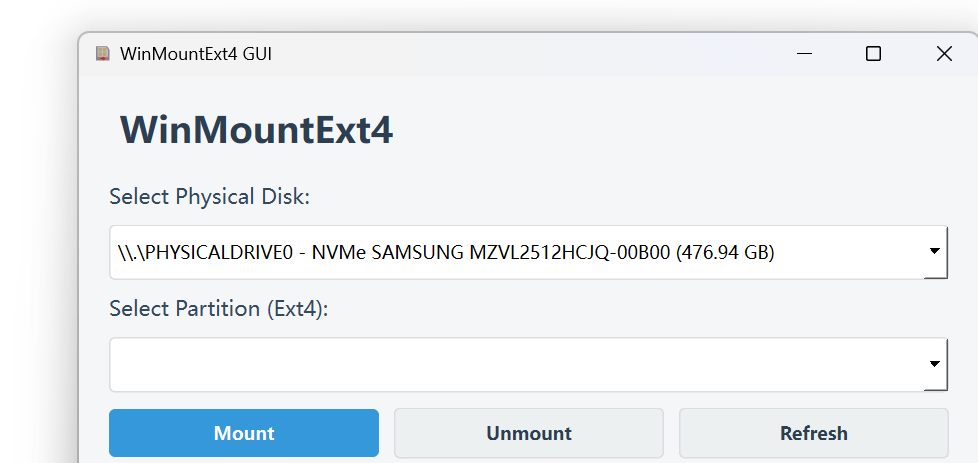
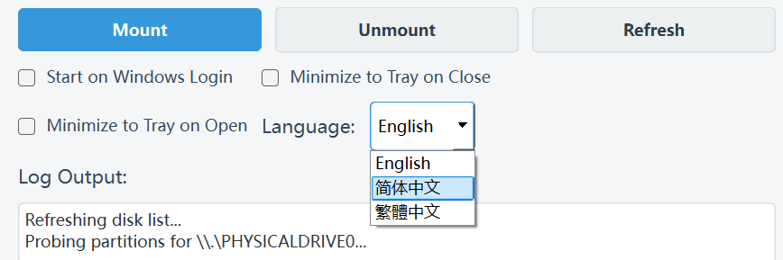

# WinMountExt4

A little tool run on windows 10/11 to mount your ext4 disk via WSL2. 

**License:** MIT License.

## GUI Version (Recommended)
Now comes with a native C++ Qt-based GUI for easier operation.

### How to use
1. Install WSL2.
2. Build the project using Qt Creator or `qmake` & `make`/`nmake`.
3. Run `WinMountExt4.exe` (it will automatically request Administrator privileges).

## Batch Version
1. Install WSL2.
2. Run with powershell(**Administrator**) `./MountExt4.bat` to mount your disk.
3. Run with powershell(**Administrator**) `./UnmountExt4.bat` to unmount your disk.

You are allowed to access the mounted disk in **windows explorer** directory.
for default the `\\wsl.localhost\Ubuntu\mnt\wsl\ext4_disk`.

## Features
- Native GUI based on C++ and Qt.
- One-click mount/unmount.
- Support for "Startup when user login" (Optional in settings).

- Native Multi Language Support:  **Chinese Simplified, Chinese Traditional, English **.

## After All

Enjoy yourself!🦖

